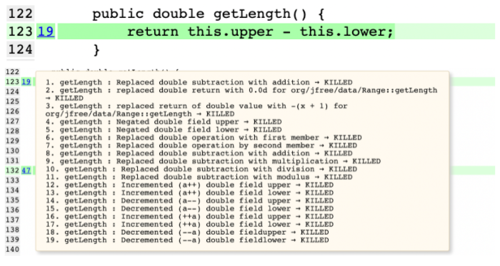
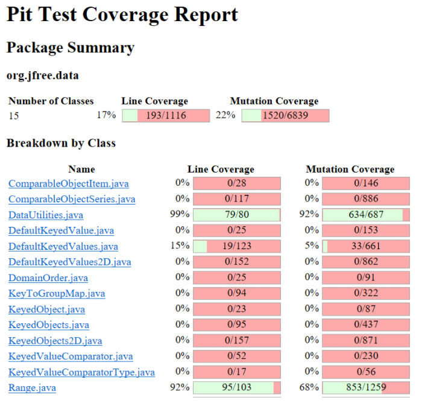

# **SENG 438 - Software Testing, Reliability, and Quality**

## **Lab. Report #4 – Mutation Testing and Web app testing**

| Group \#:       | 32  |
|-----------------|---|
| Student Names:  |   |
|                 |  Benson Li      |
|                 |  Henrique Andras |
|                 |  Kevin Araujo  |
|                 |   Mohamed Yassin  |

# **Introduction**

In this lab, we will be working on Mutation and GUI testing, particularly through a java-based mutation tool for mutation testing and Selenium for GUI testing. 

# **Analysis of 10 Mutants of the Range class**

For line 90: 

1. The mutant replaced the `if(lower > upper)` conditional to just automatically make the comparison check `false`. Since we did not have a test case to catch the `IllegalArgumentException `when the lower range is larger than the upper range, the mutation survived. 
2. The mutant negated the result of the `if(lower > upper) `conditional meaning that it would flip `true `to `false `and vice versa. Since this would mean a range that is properly created would throw an IllegalArgumentException, the mutant was killed whenever a range with `lower > upper `was created. 

For line 105: 

3. The mutant `Decremented (++a)` was killed. This is because `++a` would reduce the lower value by 1 before returning it, resulting in the outcome of the test being different, thus killing the mutant.

For line 114:

4. The mutant `Incremented (a++)` survived. This is because we did not re-check the range to have the same original values, thus when it returns the normal value for the test case and passes, the original range value that changed was undetected making the mutant survive. 

For line 123:

5. The mutant `Replaced double subtraction with addition `was killed. The function originally finds the difference between the upper value and lower values of the range, but the mutant instead found the sum of the two and was killed when the resulting length calculations were different.

For line 144:

6. The mutant `Incremented (a++) double local variable number 1` survived. This is because we did not re-check the range to have the same original values, thus when it returns the normal value for the test case and passes, the original range value that changed was undetected making the mutant survive. 

For line 157:

7. The mutant `greater than to not equal `survived. This is because we did not have the proper boundary test to check when `b0 = this.lower`, thus when the mutation changed the conditional to `!=` it survives. 
8. The mutant `Decremented (--a) double field lower `survived. This is also because we did not have a proper boundary test to check immediately around the boundary. So when it decrements lower, our test cases fail to detect it. 

For line 176: 

9. The mutant `replaced boolean return with true` survived. This is because we did not have a test case with two ranges that don't intersect which would result in a test case that returns `false`, so when the mutant replaces the function to always return `true`, the mutant survives. 

For line 217:

10. The mutation `not equal to equal` was killed. This is because we have a test case that tested for a range that is null, resulting in the mutant being caught when the conditional was changed to `range1 != null`.

# **Report all the statistics and the mutation score for each test class**

## **Range**

Before improving the Range test suite, the original mutation score was 58%. We are aiming for a 10% increase, so 68% is the target mutation coverage.

Our goal was to reach 68% mutation coverage after writing an improved test suite. This involved slightly increasing our line coverage for some methods we did not previously test for and writing more robust test cases for the ther methods. 

## **DataUtilities**

Before improving the DataUtilities test suite, this was the original mutation score that we ran on our DataUtilities test class. (Note: this class uses the same tests from assignment 3 with the exception of a few failures that we fixed, and it is combined into one class this time).

Our goal for DataUtilities.java to reach a 95% mutation score after writing improved test suites. 

Improvements:

In calculateColumnTotal, there were mutations surviving because of changes in the equality, for example, a &lt; was changed to a ==. We added more test cases to have different equalities.

In equal(), we added different types of arrays such as null arrays, and arrays of different lengths, as the mutations helped us find test cases that we have not already covered. 

Analyzing the mutation results, it looks like a lot of mutations change equalities and conditionals, so tests with different combinations of equalities and conditionals will be used as a strategy.

There was also a common case in which a for loop &lt; was changed to != that was surviving often, so for that, tests were created with length 0 so that they will always be equal, rather than pass the != check.

## **Final Mutation Testing Results:**

# **Analysis drawn on the effectiveness of each of the test classes**

For Range, our test suites are very effective. There is 92% line coverage, which means we have tests for almost every feature in Range.java, and we have 853/1259 or 68% mutation coverage. Previously, we were at a 58% mutation coverage for Range.java and the extra 10% allowed us to find other cases we would not have thought of, so the test suite is even stronger now. The test suite can be slightly improved by aiming for a higher mutation coverage, such as > 90%, but a lot of those mutants are for cases that may be unlikely to happen or equivalent mutants, thus, the test suite is still very effective overall. 

For DataUtilities, our test suite is also very effective. Over 92% of the mutants were killed by the tests, which means our test suites are very good at catching faults. The missing 8% is mostly attributed to equivalent mutants which behave the same way as the original program, and thus will not impact the actual functionality of the program, meaning our test suite is still extremely effective. 

# **A discussion on the effect of equivalent mutants on mutation score accuracy**

The abundance of equivalence mutants that were generated on the code made it so the mutation score became “artificially lower”. By this, we mean that some mutations, although not relevant to the overall robustness of the tests, contributed a significant amount in lowering our mutation score accuracy.  In turn, creating a “soft cap” on how much we can improve the mutation score while directly reflecting on the quality and robustness of tests.

# **A discussion of what could have been done to improve the mutation score of the test suites**

In general, repeating the same process we were implementing in doing this lab. Which is working backward from the mutants which survived, meaning looking at which mutants survived, asking ourselves why they survived and developing a test case specifically targeting the niche situation in which the mutation survived. While this won’t be useful against equivalent mutations, this process does a good job of creating new better test cases.

# **Why do we need mutation testing? Advantages and disadvantages of mutation testing**

Mutation testing is needed for developing effective test cases and a robust test suite. A high-quality test suite ensures that the software developed is fault-free and executes properly by being able to detect and fix errors in the source code. 

Advantages: 

* It can automatically detect all the faults in the source code 
* Can detect more errors than can be detected with just analysis
* It ensures that the source code has high coverage with the tests
* Thoroughly tests the program with all the mutations
* Makes good quality and reliable programs

Disadvantages:

* Is time-consuming and resource-intensive, especially for more complex programs
* Mutations are usually very simple changes to the source code and more complex mutations can be hard to implement
* It cannot be used for black-box testing

# **Explain your SELENUIM test case design process**

Each person looked first into exploring the website and its functionalities, with some knowledge of the system we designed test cases that covered essential parts of each website's functionality. Since many were focused on selling products and building customer loyalty, we focused on login and adding to cart functionalities. Beyond that, we also touched on some other functionalities which we thought were important.

# **Explain the use of assertions and checkpoints**

Assertions and checkpoints are set and used to verify the intended outcomes of the GUI during testing, for example, it can check whether or not certain text fields are filled out properly or if the website was redirected to the intended page. It can also be used for data values and objects to test expected output, a checkpoint can be set to make sure that input has a proper output.

# **How did you test each functionality with different test data**

There were some tests that we could not insert different test data into, which is due to the nature of the website and how we could not give it a “wrong” input to test some functionalities. For the functionalities which depended more on input like login, it was more straightforward to test, we provided valid and invalid inputs and observed and recorded the results in each case.

In the case of SportChek, when we tried to run the scripts to login automatically, the test failed because it didn't not allow us to login. This is presumably an intended function to stop scalpers from buying up stock, otherwise it would be a defect in the login system. 

# **Discuss advantages and disadvantages of Selenium vs. Sikulix**

Selenium:

Advantages:

* Multiple browsers support
* Relatively simple to use
* Tests functionalities very well
* Great for automating repetitive tests

Disadvantages:

* Only supports web applications
* No support for image testing
* Takes a big time to create tests
* Limited on what things can be tested

Sikulix:

Advantages:

* Image-based, meaning it works with everything
* Easy to use and easy to read and visualize the tests
* Not much detail is needed into coding and UI composition

Disadvantages:

* Slower
* Does not support play-back functionality
* Poor documentation
* Takes even more time than Selenium

# **How the teamwork/effort was divided and managed**

For the first part, mutation testing, we did analysis on two of the range mutants and analyzed why one was killed and why one survived, then evenly separated for each member to analyze two mutants each. Then for trying to increase our mutation coverage, we split into pairs to work on Range and DataUtilities to write more test cases based on which mutations survived. 

# **Difficulties encountered, challenges overcome, and lessons learned**

The setup was a great difficulty as per usual on these labs. In once case, Pitest could only run on a Java 8 jre so even when the code was using libraries and compiled in Java 8, it was necessary to download the jre and jdk online after making an Oracle account. 

In addition to that we struggled a lot with raising up mutation testing score, partly because at some point it becomes exponentially harder to increase the score, this was due in part because of the artificial cap created by equivalent mutants but also how we had to target thinner and thinner sections of the code, leading to diminishing returns. It was rough to overcome these challenges but we managed to do it and additionally learned a lot about GUI mutations and how coordinating with team members is important.

# **Comments/feedback on the lab itself**

The lab is good to learn about mutation and GUI testing and also to learn how to use a testing tool to automate the generation of the tests. However, we could have more instructions on the setup because we took a lot of time just setting everything up to start working. I hope we will have a schedule for in-person demos so groups don't have to sit there waiting or have the option for demos to be conducted over Zoom.

As well, it takes ~10 minutes to run mutation testing every time we make a change, this makes it take longer to improve mutation scores and we had wished the lab instructions had an easier way to test this.
